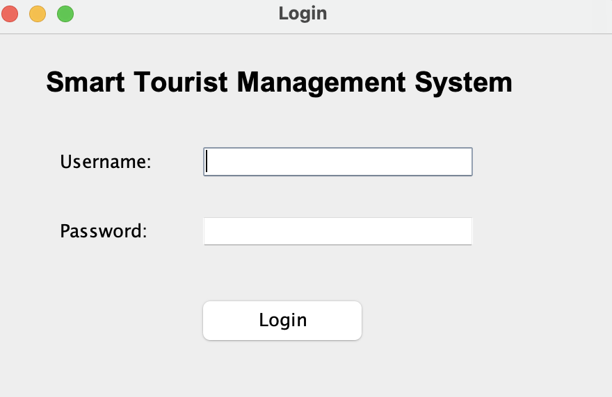
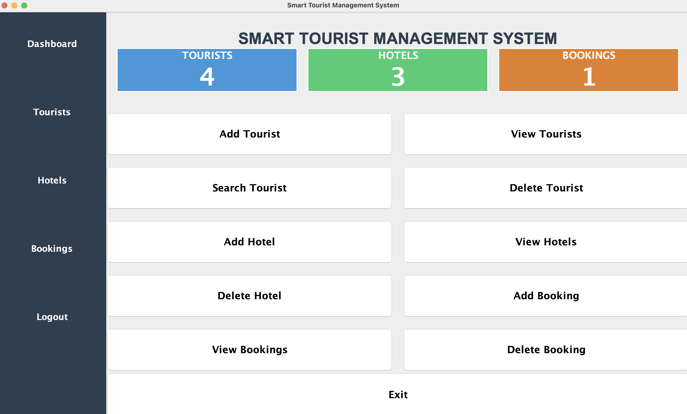
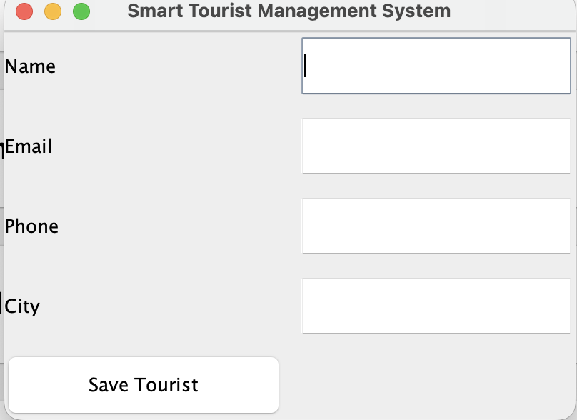
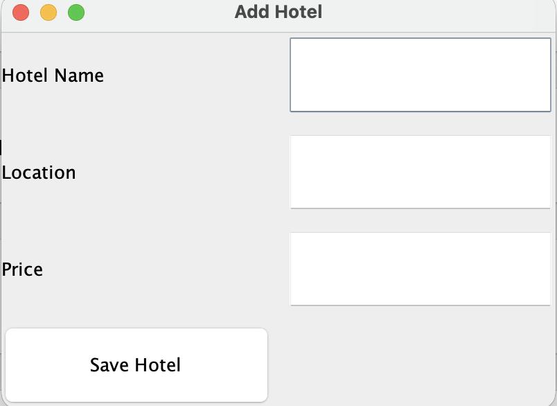
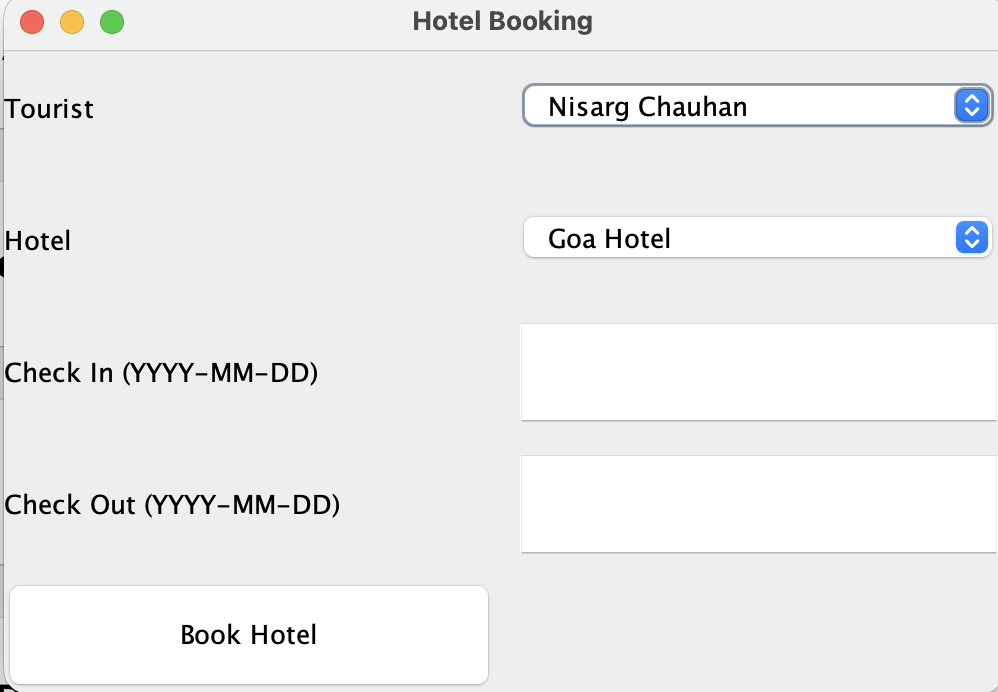

# Smart Tourist Management System

A desktop-based tourism management application developed using **Java Swing** and **MySQL**. The system provides an integrated platform for managing tourists, hotels, and bookings through an intuitive graphical user interface.

---

## Project Overview

The Smart Tourist Management System is designed to simplify tourism-related operations by centralizing tourist records, hotel information, and booking management. The application enables efficient data handling through a user-friendly dashboard and real-time database integration.

---

## Features

### Tourist Management

* Add new tourists
* View tourist records
* Search tourists
* Delete tourist information

### Hotel Management

* Add hotel details
* View available hotels
* Delete hotel records

### Booking Management

* Create bookings
* View booking history
* Delete bookings

### Dashboard Analytics

* Total tourist count
* Total hotel count
* Total booking count
* Real-time statistics display

---

## Technologies Used

* Java
* Java Swing
* MySQL
* JDBC (MySQL Connector/J)
* Object-Oriented Programming (OOP)
* VS Code

---

## Project Structure

```text
Smart-Tourist-Management-System
│
├── screenshots
│
├── src
│   ├── db
│   ├── model
│   ├── ui
│   └── util
│
├── README.md
└── .gitignore
```

---

## Database Design

Database Name:

```sql
tourist_system
```

Tables:

```sql
tourists
hotels
bookings
```

Relationships:

* Primary Keys
* Foreign Keys
* Relational Database Structure

---

## Screenshots

### Login



### Dashboard



### Add Tourist



### View Tourists


### Add Hotel



### View Hotels


### Add Booking



### View Bookings


---

## Installation & Setup

### 1. Clone Repository

```bash
git clone https://github.com/your-username/Smart-Tourist-Management-System.git
```

### 2. Create Database

```sql
CREATE DATABASE tourist_system;
```

### 3. Create Required Tables

Import the provided SQL schema or create the tables manually.

### 4. Download MySQL Connector/J

Download MySQL Connector/J from:

https://dev.mysql.com/downloads/connector/j/

Add the JAR file to your project's library path.

### 5. Configure Database Credentials

Update database credentials inside:

```text
src/db/DBConnection.java
```

### 6. Run Application

Run:

```text
Main.java
```

---

## Learning Outcomes

* Java GUI Development using Swing
* JDBC Database Connectivity
* CRUD Operations
* Object-Oriented Programming
* DAO Pattern Implementation
* MySQL Database Management
* Desktop Application Development

---

## Future Enhancements

* User Authentication System
* Online Hotel Booking Integration
* Tourist Recommendation Engine
* Interactive Maps Integration
* PDF Report Generation
* Data Export Features

---

## Author

**Nisarg Chauhan**

Computer Science & Design

Sardar Vallabhbhai Patel Institute of Technology, Vasad

---

## License

This project is developed for educational and portfolio purposes.
