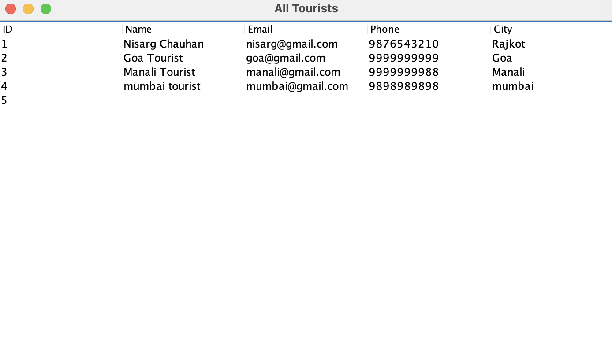
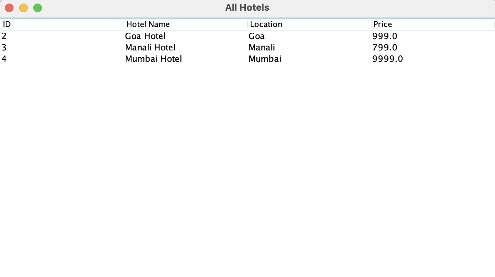
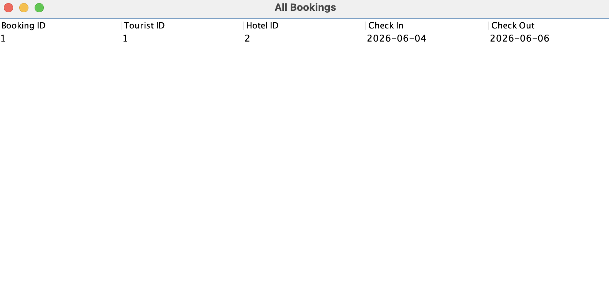

# Smart Tourist Management System

A desktop-based tourism management application developed using Java Swing, JDBC, and MySQL. The system provides an integrated platform for managing tourists, hotels, and bookings through a user-friendly graphical interface.

---

## Project Overview

The Smart Tourist Management System is designed to simplify tourism-related operations by centralizing tourist records, hotel information, and booking management. The application enables efficient data handling through a secure and intuitive desktop dashboard.

This project was developed as an academic project to demonstrate Java programming, Object-Oriented Programming concepts, JDBC connectivity, database management, and GUI development using Java Swing.

---

## Features

### Tourist Management
- Add New Tourist
- Search Tourist Records
- View Tourist Information
- Delete Tourist Records

### Hotel Management
- Add Hotel Details
- View Available Hotels
- Search Hotels
- Delete Hotel Records

### Booking Management
- Create New Bookings
- View Booking Details
- Manage Tourist-Hotel Reservations
- Delete Booking Records

### Dashboard
- Centralized Management Dashboard
- Easy Navigation Between Modules
- User-Friendly Interface

---

## Technologies Used

| Technology | Purpose |
|------------|----------|
| Java | Core Programming Language |
| Java Swing | Graphical User Interface |
| JDBC | Database Connectivity |
| MySQL | Database Management |
| MySQL Connector/J | JDBC Driver |
| Object-Oriented Programming | Application Architecture |

---

## Project Structure

```text
SmartTouristManagementSystem/
│
├── src/
│   ├── db/
│   │   ├── BookingDAO.java
│   │   ├── DashboardDAO.java
│   │   ├── DBConnection.java
│   │   ├── HotelDAO.java
│   │   └── TouristDAO.java
│   │
│   ├── model/
│   │   ├── Booking.java
│   │   ├── Hotel.java
│   │   └── Tourist.java
│   │
│   ├── ui/
│   │   ├── Dashboard.java
│   │   ├── LoginForm.java
│   │   ├── HotelForm.java
│   │   ├── TouristForm.java
│   │   ├── BookingForm.java
│   │   └── Other UI Classes
│   │
│   └── util/
│
├── screenshots/
│
├── lib/
│   └── mysql-connector-j-9.6.0.jar
│
├── Main.java
├── README.md
└── .gitignore
```

---

## Database

### Database Used
MySQL

### Main Tables

- Tourist
- Hotel
- Booking

The application uses JDBC to establish a connection between the Java application and the MySQL database.

---

## Installation & Setup

### 1. Clone Repository

```bash
git clone https://github.com/nisargchauhan-7/Smart-Tourist-Management-System.git
```

### 2. Open Project

Open the project using:
- NetBeans
- IntelliJ IDEA
- VS Code

### 3. Configure Database

Create a MySQL database and import the required tables.

Update database credentials in:

```java
DBConnection.java
```

Example:

```java
String url = "jdbc:mysql://localhost:3306/tourism_db";
String user = "root";
String password = "your_password";
```

### 4. Add MySQL Connector

Ensure the following JDBC driver is available:

```text
lib/mysql-connector-j-9.6.0.jar
```

### 5. Run Application

Execute:

```java
Main.java
```

---

## Screenshots

### Login Page


### Dashboard


### Add Tourist


### Add Hotel


### View Tourist


### View Hotel


### View Booking


---

## Learning Outcomes

This project helped in understanding:

- Java Swing GUI Development
- Object-Oriented Programming
- JDBC Connectivity
- MySQL Database Operations
- CRUD Operations
- Event Handling
- Desktop Application Development
- Software Design Principles

---

## Future Enhancements

- User Authentication System
- Role-Based Access Control
- Report Generation
- Online Booking Integration
- Payment Gateway Support
- Advanced Search & Filtering
- Export Data to PDF/Excel

---

## Author

**Nisarg Chauhan**

Computer Science and Design (CSD)

Sardar Vallabhbhai Patel Institute of Technology, Vasad

---

## License

This project is developed for educational and academic purposes.